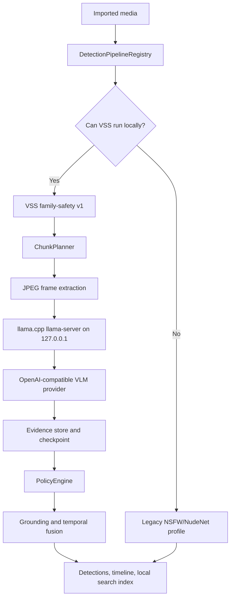

# KidsLens Video Editor - System Architecture

This document provides a comprehensive overview of the KidsLens Video Editor architecture, including layer descriptions, data flow, and component interactions.

## Table of Contents

- [High-Level Architecture](#high-level-architecture)
- [Layer Descriptions](#layer-descriptions)
- [Data Flow](#data-flow)
- [Local Family-Safety VSS Pipeline](#local-family-safety-vss-pipeline)
- [Component Interactions](#component-interactions)
- [Native Integration Architecture](#native-integration-architecture)

---

## High-Level Architecture

```
┌─────────────────────────────────────────────────────────────────────────────┐
│                           KidsLens Application                              │
├─────────────────────────────────────────────────────────────────────────────┤
│                              PRESENTATION LAYER                             │
│  ┌─────────────┐  ┌──────────────┐  ┌─────────────┐  ┌──────────────────┐   │
│  │   Import    │  │   Preview    │  │  Timeline   │  │    Settings      │   │
│  │   Screen    │  │   Screen     │  │   Editor    │  │    Screen        │   │
│  └─────────────┘  └──────────────┘  └─────────────┘  └──────────────────┘   │
│  ┌─────────────┐  ┌──────────────┐  ┌─────────────┐  ┌──────────────────┐   │
│  │  Detection  │  │    Export    │  │  Onboarding │  │     About        │   │
│  │   Review    │  │   Screen     │  │    Flow     │  │     Screen       │   │
│  └─────────────┘  └──────────────┘  └─────────────┘  └──────────────────┘   │
├─────────────────────────────────────────────────────────────────────────────┤
│                           STATE LAYER (Riverpod)                            │
│  ┌─────────────┐  ┌──────────────┐  ┌─────────────┐  ┌──────────────────┐   │
│  │   Media     │  │   Analysis   │  │  Timeline   │  │     Model        │   │
│  │  Notifier   │  │  Notifier    │  │  Notifier   │  │    Notifier      │   │
│  └──────┬──────┘  └──────┬───────┘  └──────┬──────┘  └────────┬─────────┘   │
│         │                │                 │                   │            │
│  ┌──────┴──────┐  ┌──────┴───────┐  ┌──────┴──────┐  ┌────────┴─────────┐   │
│  │  Settings   │  │   Derived    │  │   Service   │  │    Export        │   │
│  │  Notifier   │  │  Providers   │  │  Providers  │  │   Notifier       │   │
│  └─────────────┘  └──────────────┘  └─────────────┘  └──────────────────┘   │
├─────────────────────────────────────────────────────────────────────────────┤
│                              JOB SYSTEM                                     │
│  ┌──────────────────────────────────────────────────────────────────────┐   │
│  │  AnalysisJob: queued → running → paused → resumed → completed/failed │   │
│  │  ExportJob:   queued → running → paused → resumed → completed/failed │   │
│  │  • CancellationToken support                                          │   │
│  │  • Checkpoint/resume with artifact caching                            │   │
│  │  • Progress reporting with ETA                                        │   │
│  └──────────────────────────────────────────────────────────────────────┘   │
├─────────────────────────────────────────────────────────────────────────────┤
│                           SERVICE LAYER                                     │
│  ┌─────────────────┐  ┌─────────────────┐  ┌─────────────────────────────┐  │
│  │  Media Service  │  │ Analysis Service│  │  Model Manager Service      │  │
│  │  • Import       │  │  • ASR Pipeline │  │  • Download with resume     │  │
│  │  • Export       │  │  • Visual AI    │  │  • Validation               │  │
│  │  • Transcode    │  │  • Profanity    │  │  • GPU detection            │  │
│  │  • Streaming    │  │  • Timeline     │  │  • Fallback handling        │  │
│  └─────────────────┘  └─────────────────┘  └─────────────────────────────┘  │
│  ┌─────────────────┐  ┌─────────────────┐  ┌─────────────────────────────┐  │
│  │Export Service   │  │Profanity Service│  │Sample Analysis Service      │  │
│  │  • Encoding     │  │  • Word lists   │  │  • Quick preview            │  │
│  │  • Filters      │  │  • Leetspeak    │  │  • 5-second samples         │  │
│  │  • Multiplexing │  │  • Phonetics    │  │  • Detection testing        │  │
│  └─────────────────┘  └─────────────────┘  └─────────────────────────────┘  │
│  ┌──────────────────────────────────────────────────────────────────────┐   │
│  │ Local VSS Family-Safety Pipeline                                     │   │
│  │ • Official model-bundle catalog                                      │   │
│  │ • Pinned llama.cpp loopback runtime                                  │   │
│  │ • Chunked VLM analysis, grounding, policy fusion, local search       │   │
│  │ • Legacy NSFW/NudeNet profile remains selectable as fallback         │   │
│  └──────────────────────────────────────────────────────────────────────┘   │
├─────────────────────────────────────────────────────────────────────────────┤
│                              DATA LAYER                                     │
│  ┌─────────────┐  ┌──────────────┐  ┌─────────────┐  ┌──────────────────┐   │
│  │  MediaFile  │  │  Transcript  │  │  Detection  │  │    Timeline      │   │
│  └─────────────┘  └──────────────┘  └─────────────┘  └──────────────────┘   │
│  ┌─────────────┐  ┌──────────────┐  ┌─────────────┐  ┌──────────────────┐   │
│  │ Modification│  │AnalysisResult│  │  ModelInfo  │  │AnalysisSettings  │   │
│  └─────────────┘  └──────────────┘  └─────────────┘  └──────────────────┘   │
├─────────────────────────────────────────────────────────────────────────────┤
│                          NATIVE LAYER (FFI)                                 │
│  ┌─────────────────┐  ┌─────────────────┐  ┌─────────────────────────────┐  │
│  │     FFmpeg      │  │   whisper.cpp   │  │      ONNX Runtime           │  │
│  │  Media Process  │  │  Speech-to-Text │  │     Visual AI Models        │  │
│  └─────────────────┘  └─────────────────┘  └─────────────────────────────┘  │
│  ┌─────────────────┐  ┌─────────────────┐  ┌─────────────────────────────┐  │
│  │   Meta MMS      │  │ Resource Manager│  │     Memory Monitor          │  │
│  │  Multilingual   │  │  FFI Lifecycle  │  │     Pressure Handling       │  │
│  └─────────────────┘  └─────────────────┘  └─────────────────────────────┘  │
└─────────────────────────────────────────────────────────────────────────────┘
```

---

## Layer Descriptions

### 1. Presentation Layer

The presentation layer contains all Flutter widgets and screens. It follows a reactive pattern where UI components subscribe to state changes via Riverpod.

**Location:** `lib/presentation/`

#### Screens (`lib/presentation/screens/`)

| Screen | Purpose |
|--------|---------|
| `home_screen.dart` | Main dashboard with media status and analysis controls |
| `import_screen.dart` | Media file selection and import workflow |
| `preview_screen.dart` | Video/audio playback with detection overlay |
| `timeline_editor_screen.dart` | Visual timeline with detection segments |
| `detection_review_screen.dart` | Manual review and correction of detections |
| `export_screen.dart` | Export configuration and progress |
| `settings_screen.dart` | Application and analysis settings |
| `model_selection_screen.dart` | AI model download and selection |
| `onboarding_screen.dart` | First-run setup wizard |
| `about_screen.dart` | App info and attributions |
| `sample_analysis_screen.dart` | 5-second sample analysis preview |

#### Widgets (`lib/presentation/widgets/`)

- **common/** - Reusable components (buttons, cards, progress indicators)
- **detection/** - Detection-specific visualizations
- **dialogs/** - Modal dialogs and sheets
- **models/** - Model selection widgets
- **player/** - Video/audio player components
- **timeline/** - Timeline visualization widgets

#### Themes (`lib/presentation/themes/`)

- `app_theme.dart` - Material 3 theme definitions with light/dark modes

---

### 2. State Layer

The state layer manages application state using Riverpod with code generation. It follows the notifier pattern for mutable state.

**Location:** `lib/state/providers/`

#### Core Notifiers

| Provider | Purpose | Persistence |
|----------|---------|-------------|
| `MediaNotifier` | Current media file, loading state, recent files | `keepAlive: true` |
| `AnalysisNotifier` | Analysis progress, results, pause/resume | `keepAlive: true` |
| `TimelineNotifier` | Timeline state, selections, playhead position | `keepAlive: true` |
| `SettingsNotifier` | App settings, analysis configuration | `keepAlive: true` |
| `ModelNotifier` | Downloaded models, download progress | `keepAlive: true` |

#### Derived Providers

Located in `derived_providers.dart`, these are computed providers that derive data from notifiers:

- `pendingDetections` - Detections awaiting user review
- `detectionCounts` - Count by detection type
- `canStartAnalysis` - Whether analysis can begin
- `canStartExport` - Whether export is available
- `totalModelDiskUsage` - Total disk space used by models
- `detectionSummary` - Aggregated detection statistics

#### Service Providers

Located in `service_providers.dart`, these instantiate and provide services:

```dart
@Riverpod(keepAlive: true)
AnalysisService analysisService(AnalysisServiceRef ref) {
  return AnalysisService(
    ffmpeg: ref.watch(ffmpegBindingsProvider),
    whisper: ref.watch(whisperBindingsProvider),
    mms: ref.watch(mmsBindingsProvider),
    onnx: ref.watch(onnxBindingsProvider),
    modelManager: ref.watch(modelManagerServiceProvider),
    profanity: ref.watch(profanityServiceProvider),
  );
}
```

---

### 3. Service Layer

The service layer contains business logic and coordinates between the state layer and native bindings.

**Location:** `lib/services/`

#### Services

| Service | Responsibilities |
|---------|------------------|
| `MediaService` | Media import, metadata extraction, frame/audio extraction |
| `AnalysisService` | Routes analysis through pluggable detection pipelines; the default VSS pipeline runs local VLM chunk analysis, policy fusion, search indexing, and legacy fallback |
| `ExportService` | Applies modifications and exports processed media |
| `ProfanityService` | Dictionary-based profanity detection with phonetic matching |
| `ModelManagerService` | Model downloads, validation, and lifecycle |
| `SampleAnalysisService` | Quick 5-second sample analysis for preview |

#### Detection Pipeline Architecture

`AnalysisService` uses `DetectionPipelineRegistry` to select the active
pipeline from `AnalysisSettings.analysisPipelineId`. The default profile is
`vss_family_safety_v1`, implemented by
`lib/services/detection/vss_family_safety_pipeline.dart`.

The VSS pipeline is fully local. It resolves the official Qwen3-VL GGUF bundle
from the model catalog, verifies downloaded artifacts and the pinned llama.cpp
runtime, starts `llama-server` on loopback, plans deterministic video chunks,
extracts JPEG frame payloads, and sends them to the local OpenAI-compatible
provider. Provider responses persist as `EvidenceRecord`s, then
`PolicyEngine` and `PolicyDetectionBuilder` create the final `Detection` list
and `UnifiedTimeline`. Evidence, `AnalysisRunManifest`, `vss_checkpoint.json`,
and the family-safety search index are written under the per-media analysis
cache directory so runs can resume after cancellation.

Settings expose the local model bundle catalog and the pinned llama.cpp CUDA /
Vulkan runtime installs. If a user starts VSS analysis before the required local
model bundle or runtime is installed, the editor shows a first-run dialog that
can start official downloads or persist a switch to the legacy profile. During
VSS runs the analysis dialog reports the selected runtime, model, GPU target,
VRAM estimate, and chunk progress.

Legacy NSFW/NudeNet analysis remains available through the explicit
`legacy_nsfw_region_v8` profile and is also used as a startup fallback when the
local VSS model/runtime is not available.

#### Local Runtime and Model Governance

All family-safety inference is local-only. The VSS runtime is an app-managed
`llama-server` process bound to `127.0.0.1` with a dynamically selected port.
Only official source repos and KidsLens-owned reproducible conversions are
allowed in the model catalog. Community ports, hosted endpoints, missing
checksums, and commercial-blocked licenses are not production-selectable.

The default validation target is a high-end consumer GPU in the RTX 5070 class.
The production candidate is the official Qwen3-VL GGUF bundle running through
the pinned llama.cpp CUDA runtime, with Vulkan as a local fallback runtime.
The Qwen3 embedding GGUF bundle is used for local video search when installed;
otherwise the search index falls back to deterministic local hash embeddings.

Approximate local storage requirements:

| Component | Purpose | Expected Size |
|-----------|---------|---------------|
| Qwen3-VL 8B Q4_K_M bundle | Default VLM validation candidate | 5-7 GB |
| Qwen3-VL 4B Q4_K_M bundle | Lightweight fallback candidate | 3-4 GB |
| Qwen3 embedding 0.6B Q8 bundle | Local semantic search | 0.7-1 GB |
| llama.cpp runtime archive | CUDA or Vulkan helper process | 0.5-2 GB |
| Analysis cache | Evidence, checkpoints, search index | Project dependent |

Runtime validation is recorded by `scripts/vss_validation_runner.dart`. It
compares VSS and legacy profiles against a user-supplied unsafe validation clip
set and writes `rtxValidationGate`. The production model flip remains blocked
until this gate passes on the target hardware.

---

### 4. Data Layer

The data layer contains immutable data models using Freezed for code generation.

**Location:** `lib/data/models/`

#### Core Models

| Model | Description |
|-------|-------------|
| `MediaFile` | Represents imported video/audio with metadata |
| `Transcript` | ASR output with word-level timestamps |
| `Detection` | Identified content issue with timing and confidence |
| `Modification` | Action to apply (mute, blur, beep, etc.) |
| `UnifiedTimeline` | Complete timeline with all tracks and segments |
| `AnalysisSettings` | Detection thresholds and model configuration |
| `AnalysisResult` | Complete analysis output |
| `ModelInfo` | AI model metadata and download info |

#### Model Relationships

```
MediaFile
    ├── Transcript
    │       └── TranscriptSegment[]
    │               └── TranscriptWord[]
    │
    ├── Detection[]
    │       ├── ContentType (nsfw, violence, blood, profanity, weapons)
    │       └── DetectionUserStatus (pending, confirmed, rejected, adjusted)
    │
    └── UnifiedTimeline
            └── TimelineTrack[] (audio, video, detection)
                    └── TimelineSegment[]
                            └── Modification? (AudioMute, VideoBlur, etc.)
```

---

### 5. Native Layer

The native layer provides FFI bindings to native libraries for media processing and AI inference.

**Location:** `lib/native/`

#### Native Bindings (`lib/native/bindings/`)

| Binding | Library | Purpose |
|---------|---------|---------|
| `FFmpegBindings` | FFmpeg 6.x | Media decoding, encoding, filtering |
| `WhisperBindings` | whisper.cpp | Whisper speech recognition |
| `MMSBindings` | fairseq2/MMS | Meta multilingual ASR |
| `ONNXBindings` | ONNX Runtime | Visual AI model inference |

#### Resource Management (`lib/native/`)

| Component | Purpose |
|-----------|---------|
| `NativeResourceManager` | Tracks FFI resources with finalizers |
| `FrameBufferPool` | Manages frame buffers with backpressure |
| `MemoryMonitor` | Monitors system memory and triggers cleanup |
| `GPUManager` | GPU detection and acceleration management |

---

## Data Flow

### Analysis Pipeline Flow

Default visual analysis uses the local VSS pipeline:



The legacy visual flow remains available for compatibility and fallback:

```
┌─────────────┐
│ MediaFile   │
│ (imported)  │
└──────┬──────┘
       │
       ▼
┌─────────────────────────────────────────────────────────────────┐
│                     ANALYSIS PIPELINE                           │
├─────────────────────────────────────────────────────────────────┤
│                                                                 │
│   ┌───────────────┐    ┌──────────────────┐    ┌────────────┐   │
│   │ Audio Track   │───▶│ ASR (Whisper/MMS)│───▶│ Transcript │   │
│   │ Extraction    │    │                  │    │            │   │
│   └───────────────┘    └──────────────────┘    └─────┬──────┘   │
│                                                      │          │
│                                                      ▼          │
│                                            ┌──────────────────┐ │
│                                            │ Profanity Service│ │
│                                            │ • Dictionary     │ │
│                                            │ • Leetspeak      │ │
│                                            │ • Phonetic       │ │
│                                            └────────┬─────────┘ │
│                                                     │           │
│   ┌───────────────┐    ┌──────────────────┐        │           │
│   │ Frame         │───▶│ Scene Detection  │        │           │
│   │ Extraction    │    │ (keyframe+1-2fps)│        │           │
│   └───────────────┘    └────────┬─────────┘        │           │
│                                 │                   │           │
│                                 ▼                   │           │
│                        ┌──────────────────┐        │           │
│                        │ Visual Models    │        │           │
│                        │ • NSFW           │        │           │
│                        │ • Violence       │        │           │
│                        │ • Blood          │        │           │
│                        │ • Weapons        │        │           │
│                        └────────┬─────────┘        │           │
│                                 │                   │           │
│                                 ▼                   ▼           │
│                        ┌─────────────────────────────┐          │
│                        │    Temporal Aggregator      │          │
│                        │    • Merge adjacent         │          │
│                        │    • Apply hysteresis       │          │
│                        │    • Add detection buffer   │          │
│                        └─────────────┬───────────────┘          │
│                                      │                          │
└──────────────────────────────────────┼──────────────────────────┘
                                       │
                                       ▼
                              ┌─────────────────┐
                              │ UnifiedTimeline │
                              │ with Detections │
                              └────────┬────────┘
                                       │
                                       ▼
                              ┌─────────────────┐
                              │ User Review     │
                              │ (confirm/reject)│
                              └────────┬────────┘
                                       │
                                       ▼
                              ┌─────────────────┐
                              │ Export with     │
                              │ Modifications   │
                              └─────────────────┘
```

### State Update Flow

```
┌──────────────────┐
│   User Action    │
│   (UI Event)     │
└────────┬─────────┘
         │
         ▼
┌──────────────────┐
│    Widget        │
│  ref.read()      │
└────────┬─────────┘
         │
         ▼
┌──────────────────┐
│   Notifier       │
│  Method Call     │
└────────┬─────────┘
         │
         ▼
┌──────────────────┐
│   Service        │  ◀──────┐
│  Business Logic  │         │
└────────┬─────────┘         │
         │                   │
         ▼                   │
┌──────────────────┐         │
│   Native FFI     │         │
│   (if needed)    │         │
└────────┬─────────┘         │
         │                   │
         ▼                   │
┌──────────────────┐         │
│  State Update    │─────────┘
│  (immutable)     │
└────────┬─────────┘
         │
         ▼
┌──────────────────┐
│  ref.watch()     │
│  UI Rebuild      │
└──────────────────┘
```

---

## Component Interactions

### Job System Integration

```
┌─────────────────────────────────────────────────────────────────────┐
│                           JOB SYSTEM                                │
├─────────────────────────────────────────────────────────────────────┤
│                                                                     │
│  ┌─────────────┐         ┌────────────────┐                         │
│  │AnalysisJob  │◀───────▶│CancellationToken│                        │
│  │             │         │  • cancel()     │                        │
│  │ • execute() │         │  • pause()      │                        │
│  │ • pause()   │         │  • resume()     │                        │
│  │ • resume()  │         │  • isCancelled  │                        │
│  │ • cancel()  │         │  • isPaused     │                        │
│  └──────┬──────┘         └────────────────┘                         │
│         │                                                           │
│         ├───────────────────────────────────────┐                   │
│         │                                       │                   │
│         ▼                                       ▼                   │
│  ┌─────────────────┐                   ┌─────────────────┐          │
│  │ CheckpointMgr   │                   │  Progress       │          │
│  │ • save()        │                   │  Stream         │          │
│  │ • restore()     │                   │  • stepName     │          │
│  │ • clear()       │                   │  • progress %   │          │
│  └─────────────────┘                   │  • ETA          │          │
│                                        └────────┬────────┘          │
│                                                 │                   │
│                                                 ▼                   │
│                                        ┌─────────────────┐          │
│                                        │AnalysisNotifier │          │
│                                        │  updateProgress │          │
│                                        └─────────────────┘          │
│                                                                     │
└─────────────────────────────────────────────────────────────────────┘
```

### Provider Dependency Graph

```
                    ┌─────────────────────┐
                    │   ffmpegBindings    │
                    │   (Native FFI)      │
                    └──────────┬──────────┘
                               │
         ┌─────────────────────┼─────────────────────┐
         │                     │                     │
         ▼                     ▼                     ▼
┌─────────────────┐  ┌─────────────────┐  ┌─────────────────┐
│  mediaService   │  │  exportService  │  │ analysisService │
└────────┬────────┘  └────────┬────────┘  └────────┬────────┘
         │                    │                    │
         │                    │           ┌───────┴───────┐
         │                    │           │               │
         ▼                    ▼           ▼               ▼
┌─────────────────┐  ┌─────────────────┐  ┌─────────────────┐
│ mediaNotifier   │  │ exportNotifier  │  │ analysisNotifier│
└────────┬────────┘  └─────────────────┘  └────────┬────────┘
         │                                         │
         └─────────────────────┬───────────────────┘
                               │
                               ▼
                    ┌─────────────────────┐
                    │ Derived Providers   │
                    │ • canStartAnalysis  │
                    │ • canStartExport    │
                    │ • detectionCounts   │
                    └─────────────────────┘
```

---

## Native Integration Architecture

### FFI Resource Lifecycle

```
┌────────────────────────────────────────────────────────────────────┐
│                    NativeResourceManager                           │
├────────────────────────────────────────────────────────────────────┤
│                                                                    │
│   ┌────────────────────┐                                           │
│   │  WeakReference<T>  │ ◀──── Map<int, WeakReference>             │
│   │                    │                                           │
│   └─────────┬──────────┘                                           │
│             │                                                      │
│             ▼                                                      │
│   ┌────────────────────┐       ┌────────────────────┐              │
│   │   NativeResource   │──────▶│    Finalizer       │              │
│   │   (abstract base)  │       │   (cleanup on GC)  │              │
│   └─────────┬──────────┘       └────────────────────┘              │
│             │                                                      │
│    ┌────────┴───────────────────────┬─────────────────────┐        │
│    │                                │                     │        │
│    ▼                                ▼                     ▼        │
│ ┌──────────────┐            ┌──────────────┐      ┌──────────────┐ │
│ │FFmpegBindings│            │WhisperBindings│     │ ONNXBindings │ │
│ │releaseNative()│           │releaseNative()│     │releaseNative()││
│ └──────────────┘            └──────────────┘      └──────────────┘ │
│                                                                    │
└────────────────────────────────────────────────────────────────────┘
```

### Memory Pressure Handling

```
┌─────────────────────────────────────────────────────────────────┐
│                      MemoryMonitor                              │
├─────────────────────────────────────────────────────────────────┤
│                                                                 │
│   Timer (5s interval)                                           │
│         │                                                       │
│         ▼                                                       │
│   ┌──────────────────┐                                          │
│   │ Check Memory     │                                          │
│   │ Usage Ratio      │                                          │
│   └────────┬─────────┘                                          │
│            │                                                    │
│    ┌───────┴────────────────────────────┐                       │
│    │                                    │                       │
│    ▼                                    ▼                       │
│  < 80%                             80% - 90%                    │
│  Normal                            ┌──────────────────┐         │
│                                    │ WARNING Level    │         │
│                                    │ • Reduce batch   │         │
│                                    │ • Clear caches   │         │
│                                    └──────────────────┘         │
│                                           │                     │
│                                           ▼                     │
│                                        > 90%                    │
│                                    ┌──────────────────┐         │
│                                    │ CRITICAL Level   │         │
│                                    │ • Pause analysis │         │
│                                    │ • Release frames │         │
│                                    │ • Unload models  │         │
│                                    └──────────────────┘         │
│                                                                 │
└─────────────────────────────────────────────────────────────────┘
```

---

## Design Principles

### 1. Separation of Concerns

- **UI** knows nothing about native bindings
- **State** coordinates but doesn't implement business logic
- **Services** contain all business logic
- **Native** handles FFI complexity in isolation

### 2. Immutability

- All data models use Freezed for immutable state
- State updates create new instances
- Enables predictable state management

### 3. Dependency Injection

- All services receive dependencies via constructor
- Riverpod manages the dependency graph
- Enables easy testing and mocking

### 4. Error Boundaries

- Sealed exception hierarchy in `core/errors/`
- User-friendly error messages with remediation
- Technical details preserved for debugging

### 5. Resource Safety

- Finalizer-based cleanup for FFI resources
- Memory pressure monitoring and response
- Explicit dispose patterns where needed
